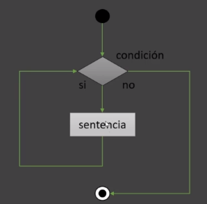
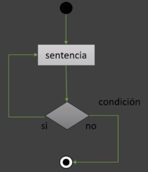
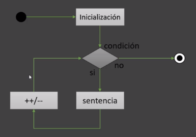

# Flujos de Control

### Sentencia While
Ejecuta un bloque de código mientras se cumpla la condición
*Es una estructura de iteración precondición, primero evalúa la expresión antes de ejecutar cualquier sentencia

### Sentencia Do While
Similar al while, excepto en que la expresión se evalúa al final del bucle, se ejecuta al menos una vez
*Es una estructura de iteración postcondición, primero ejecuta la sentencia y al final evalúa la expresión

### Sentencia For
La sentencia for se utiliza cuando se conocen los límites del bucle

